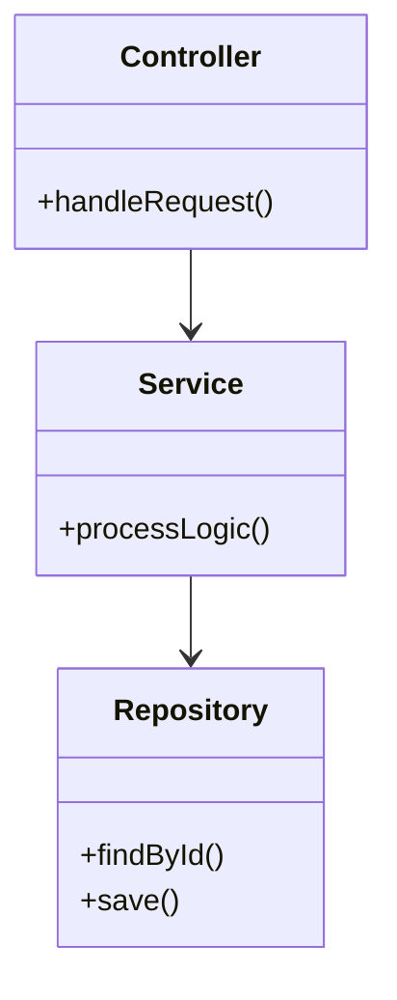
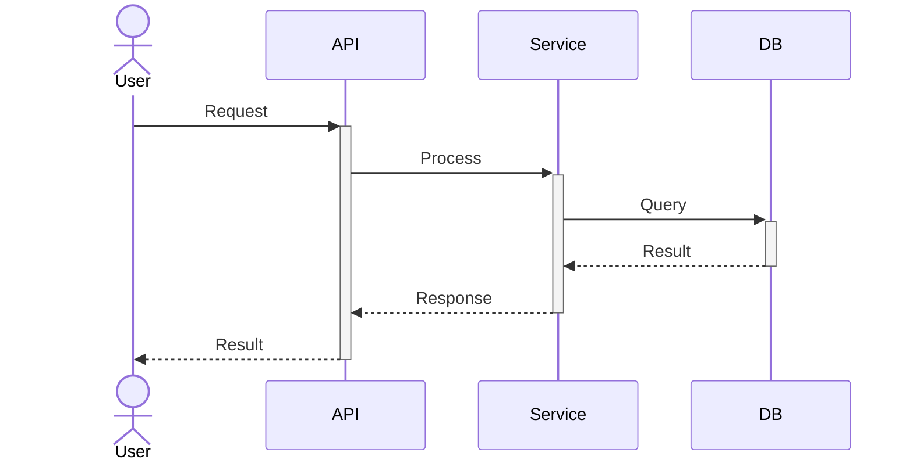

# [Project Name] — System Design Document

> **Version**: 1.0
> **Last Updated**: YYYY-MM-DD

## 1. Component Details

### 1.1 [Component Name]

**Responsibility**: [What this component does]
**Internal Structure**:



## 2. API Specifications

### 2.1 [Resource Name] API

#### GET /api/v1/[resource]

**Description**: [What this endpoint does]

**Query Parameters**:
| Parameter | Type | Required | Description |
|-----------|------|----------|-------------|
| page | int | No | Page number (default: 0) |
| size | int | No | Page size (default: 20) |

**Response 200**:
```json
{
  "content": [],
  "totalElements": 0,
  "totalPages": 0,
  "page": 0,
  "size": 20
}
```

#### POST /api/v1/[resource]

**Description**: [What this endpoint does]

**Request Body**:
| Field | Type | Required | Description |
|-------|------|----------|-------------|
| [field] | [type] | [Yes/No] | [Description] |

**Response 201**:
```json
{
  "id": "uuid",
  "status": "CREATED"
}
```

**Error Responses**:
| Code | Description |
|------|-------------|
| 400 | Invalid request body |
| 401 | Unauthorized |
| 409 | Resource already exists |

## 3. Sequence Diagrams

### 3.1 [Flow Name]



## 4. Data Models

### 4.1 [Entity Name]
| Field | Type | Description |
|-------|------|-------------|
| [field] | [type] | [description] |

## 5. Error Handling

| Error Code | HTTP Status | Description | Recovery Action |
|-----------|-------------|-------------|-----------------|
| [ERR_001] | 400 | [Description] | [What to do] |

## 6. Configuration

| Variable | Type | Default | Description |
|----------|------|---------|-------------|
| [ENV_VAR] | [type] | [default] | [Description] |

---

**Related Documents**:
- [Architecture](architecture.md) — High-level design
- [Database Schema](database-schema.md) — Data layer
- [SRS Master](business/SRS_MASTER.md) — Requirements
