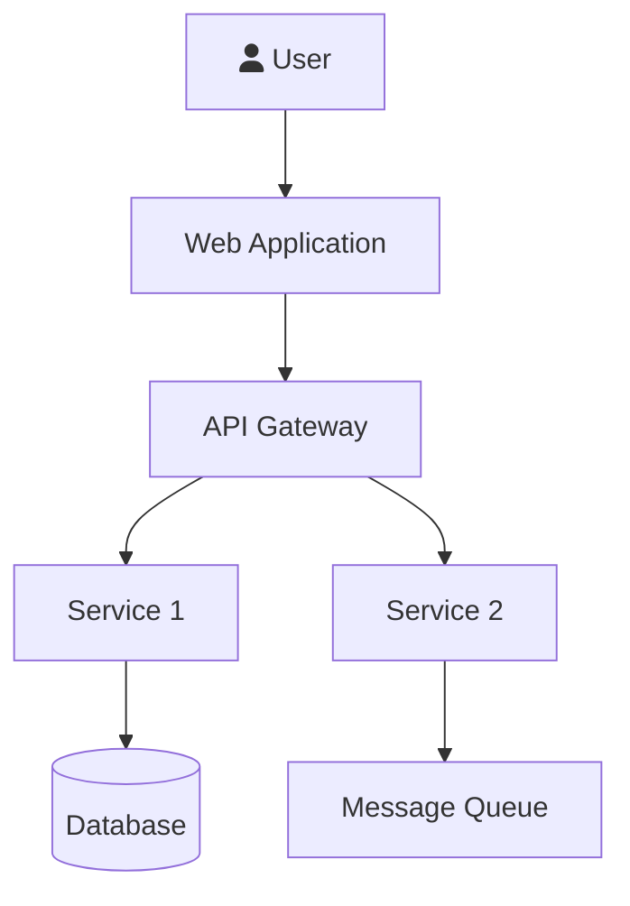
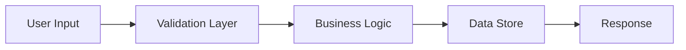
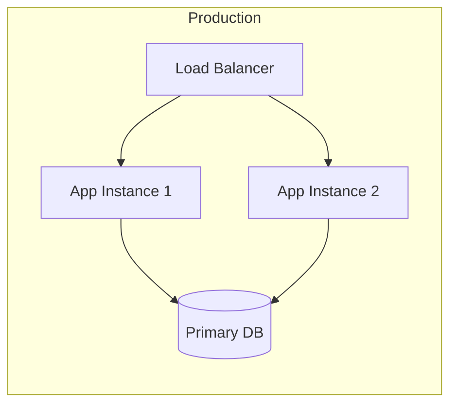

# [Project Name] — System Architecture

> **Version**: 1.0
> **Last Updated**: YYYY-MM-DD

## 1. Architecture Overview

[One paragraph describing the overall architectural style: monolith, microservices, serverless, etc.]

## 2. System Context Diagram

## 3. Component Breakdown

| Component | Responsibility | Tech Stack | Port |
|-----------|---------------|------------|------|
| [Component] | [What it does] | [Tech] | [Port] |

## 4. Communication Patterns

### Synchronous
| From | To | Protocol | Endpoint |
|------|----|----------|----------|
| [Service A] | [Service B] | REST/gRPC | [Path] |

### Asynchronous
| Publisher | Event | Consumer | Broker |
|-----------|-------|----------|--------|
| [Service A] | [Event name] | [Service B] | [MQ/Kafka] |

## 5. Data Flow

## 6. Deployment Architecture

## 7. Security Architecture

- **Authentication**: [Method — JWT, OAuth2, etc.]
- **Authorization**: [Method — RBAC, ABAC, etc.]
- **Network**: [Firewall rules, VPN, etc.]
- **Data**: [Encryption at rest, in transit]

---

**Related Documents**:
- [Tech Stack](tech-stack.md) — Technology choices
- [SDD](SDD.md) — Detailed component design
- [Database Schema](database-schema.md) — Data layer
