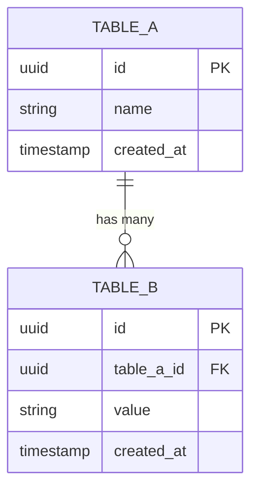

# [Project Name] — Database Schema

> **Version**: 1.0
> **Last Updated**: YYYY-MM-DD
> **Database Engine**: [e.g., PostgreSQL 16]

## 1. ER Diagram



## 2. Table Definitions

### 2.1 Table: `table_a`

**Description**: [Purpose of this table]

| Column | Type | Nullable | Default | Description |
|--------|------|----------|---------|-------------|
| id | UUID | No | gen_random_uuid() | Primary key |
| name | VARCHAR(255) | No | — | [Description] |
| created_at | TIMESTAMPTZ | No | NOW() | Creation timestamp |
| updated_at | TIMESTAMPTZ | No | NOW() | Last update timestamp |

**Primary Key**: `id`
**Unique Constraints**: [Column(s)]
**Indexes**:
| Index Name | Columns | Type | Rationale |
|-----------|---------|------|-----------|
| idx_table_a_name | name | BTREE | Name lookup queries |

### 2.2 Table: `table_b`

**Description**: [Purpose of this table]

| Column | Type | Nullable | Default | Description |
|--------|------|----------|---------|-------------|
| id | UUID | No | gen_random_uuid() | Primary key |
| table_a_id | UUID | No | — | FK to table_a |
| value | VARCHAR(500) | Yes | NULL | [Description] |
| created_at | TIMESTAMPTZ | No | NOW() | Creation timestamp |

**Primary Key**: `id`
**Foreign Keys**:
| Column | References | ON DELETE | ON UPDATE |
|--------|-----------|-----------|-----------|
| table_a_id | table_a(id) | CASCADE | CASCADE |

## 3. Relationships Summary

| Relationship | Type | Description |
|-------------|------|-------------|
| table_a → table_b | 1:N | [Description] |

## 4. Seed Data

```sql
-- Initial seed data
INSERT INTO table_a (name) VALUES ('Default');
```

## 5. Migration Notes

- **Strategy**: [e.g., Flyway, Liquibase, manual SQL]
- **Naming Convention**: `V{version}__{description}.sql`
- **Rollback**: Each migration must have a corresponding rollback script

---

**Related Documents**:
- [SDD](SDD.md) — API contracts referencing these tables
- [Architecture](architecture.md) — Data flow
