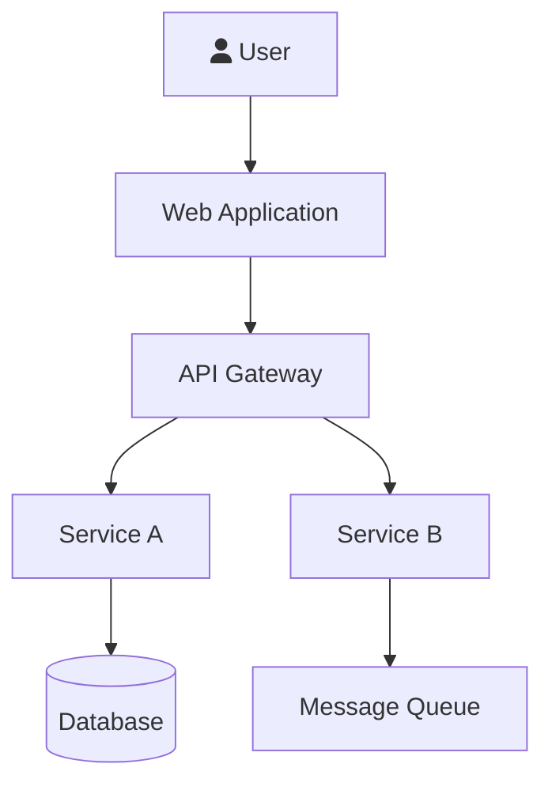
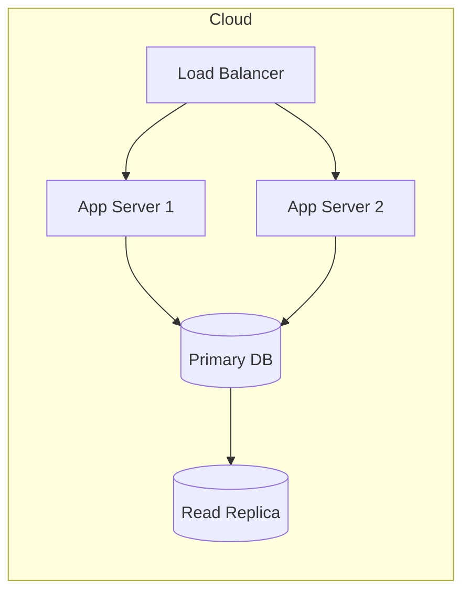
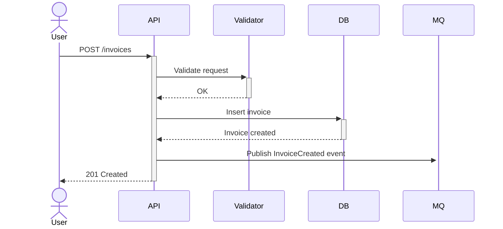
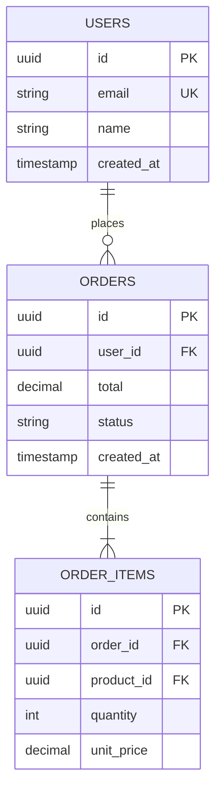

# Group 1: System Design & Data — Writing Guidelines

## Table of Contents

1. [PRD.md](#prdmd)
2. [tech-stack.md](#tech-stackmd)
3. [architecture.md](#architecturemd)
4. [SDD.md](#sddmd)
5. [database-schema.md](#database-schemamd)

---

## PRD.md

**Purpose**: Define the product vision, scope, and success criteria. This is the top-level document that all other docs reference.

### Required Sections

| Section | Description |
|---------|-------------|
| Project Overview | Name, domain, one-paragraph problem statement |
| Goals & Objectives | 3-5 measurable goals |
| User Personas | Primary and secondary users with pain points |
| Feature Summary | Table of features with priority (P0/P1/P2) and status |
| Success Metrics | KPIs and acceptance criteria |
| Constraints & Assumptions | Technical, business, or regulatory constraints |
| Out of Scope | Explicitly excluded features |

### Writing Tips
- Use **P0** (must-have), **P1** (should-have), **P2** (nice-to-have) priority levels
- Link each feature to its entry in `MASTER_BACKLOG.md`
- Keep feature descriptions to 1-2 sentences; detailed specs go in `SDD.md`

---

## tech-stack.md

**Purpose**: Lock down all technology choices with exact versions. Ensures consistency across the team.

### Required Sections

| Section | Content |
|---------|---------|
| Languages | Language name, version, purpose |
| Frameworks | Framework name, version, usage context |
| Databases | DB engine, version, purpose (primary/cache/search) |
| Infrastructure | Cloud provider, services, CI/CD tools |
| Dev Tools | IDE, linters, formatters, package managers |
| Third-party Services | External APIs, SaaS dependencies |

### Format for Each Entry

```markdown
| Technology | Version | Purpose |
|-----------|---------|---------|
| Java      | 21 LTS  | Primary backend language |
| Spring Boot | 3.4.x | REST API framework |
```

### Writing Tips
- Always specify exact versions or version ranges
- Note any version constraints or compatibility requirements
- Include links to official documentation

---

## architecture.md

**Purpose**: High-level system architecture showing how components interact. Use Mermaid diagrams.

### Required Sections

| Section | Content |
|---------|---------|
| Architecture Overview | Text description + high-level diagram |
| Component Diagram | Mermaid C4 or flowchart showing all services |
| Communication Patterns | Sync (REST/gRPC) vs Async (MQ/Events) |
| Data Flow | How data moves through the system |
| Deployment Architecture | Infrastructure topology |
| Security Architecture | Auth flow, network boundaries |

### Mermaid Diagram Examples

**System Context (C4 Level 1):**


**Deployment Diagram:**


### Writing Tips
- Start with the simplest view and progressively add detail
- Label all arrows with protocol/method (REST, gRPC, AMQP, etc.)
- Reference `tech-stack.md` for specific technology choices
- Keep diagrams focused — one concept per diagram

---

## SDD.md

**Purpose**: Detailed component design with API contracts, sequence diagrams, and error handling. This is the most technical document.

### Required Sections

| Section | Content |
|---------|---------|
| Component Details | Internal structure of each major component |
| API Specifications | Endpoint definitions with request/response schemas |
| Sequence Diagrams | Key user flows shown as Mermaid sequence diagrams |
| Data Models | Key DTOs, value objects, domain entities |
| Error Handling | Error codes, retry strategies, fallback behavior |
| Configuration | Environment variables, feature flags |

### API Specification Format

```markdown
### POST /api/v1/invoices

**Description**: Create a new invoice

**Request Body**:
| Field | Type | Required | Description |
|-------|------|----------|-------------|
| vendor_id | string (UUID) | Yes | Vendor identifier |
| amount | decimal | Yes | Invoice amount |
| currency | string | No | ISO 4217 code (default: VND) |

**Response 201**:
| Field | Type | Description |
|-------|------|-------------|
| id | string (UUID) | Created invoice ID |
| status | string | Initial status: "PENDING" |

**Error Responses**:
| Code | Description |
|------|-------------|
| 400 | Invalid request body |
| 409 | Duplicate invoice number |
```

### Sequence Diagram Example



### Writing Tips
- Group APIs by resource (invoices, users, etc.)
- Include both success and error flows in sequence diagrams
- Reference `database-schema.md` for data model details
- Document all environment configuration with defaults

---

## database-schema.md

**Purpose**: Complete database design with ER diagrams, table definitions, relationships, and constraints.

### Required Sections

| Section | Content |
|---------|---------|
| ER Diagram | Mermaid erDiagram showing all tables |
| Table Definitions | Column-by-column spec for each table |
| Relationships | 1-1, 1-N, N-N with FK specifications |
| Indexes | Performance indexes with rationale |
| Constraints | CHECK, UNIQUE, NOT NULL rules |
| Seed Data | Initial data requirements |
| Migration Notes | Migration strategy and versioning approach |

### ER Diagram Format



### Table Definition Format

```markdown
### Table: `users`

| Column | Type | Nullable | Default | Description |
|--------|------|----------|---------|-------------|
| id | UUID | No | gen_random_uuid() | Primary key |
| email | VARCHAR(255) | No | — | Unique email |
| name | VARCHAR(100) | No | — | Display name |
| created_at | TIMESTAMPTZ | No | NOW() | Creation timestamp |

**Primary Key**: `id`
**Unique Constraints**: `email`
**Indexes**: `idx_users_email` on `email`
```

### Writing Tips
- Use standard SQL types, note DB-specific types where needed
- Document all foreign key ON DELETE / ON UPDATE behavior
- Include index rationale (which queries benefit)
- Mark columns as PK, FK, UK (unique key) in ER diagram
