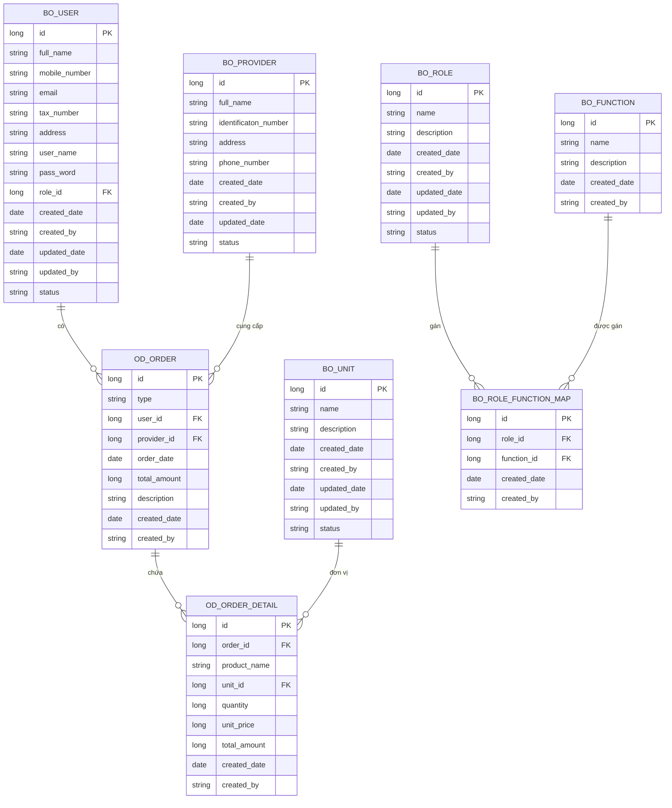
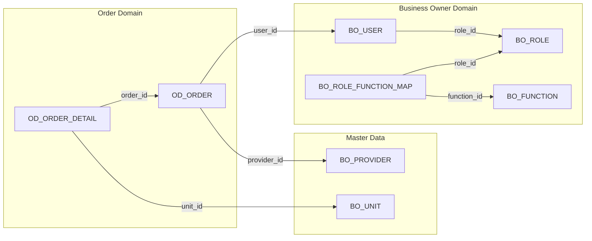

# Database Schema

> **Mục đích:** Tài liệu mô tả cấu trúc database cho dự án Business Tax Workspace. Đây là single source of truth cho tất cả schema, relationships và constraints.
>
> **Ngày cập nhật:** 2026-05-07
>
> **Số lượng bảng:** 8 tables + 1 view

---

## Mục lục

1. [Tổng quan](#tổng-quan)
2. [ER Diagram](#er-diagram)
3. [Table Definitions](#table-definitions)
   - [BO_USER - Hộ kinh doanh](#bo_user---hộ-kinh-doanh)
   - [BO_ROLE](#bo_role)
   - [BO_FUNCTION](#bo_function)
   - [BO_ROLE_FUNCTION_MAP](#bo_role_function_map)
   - [BO_PROVIDER - Nhà cung cấp](#bo_provider---nhà-cung-cấp)
   - [BO_UNIT - Đơn vị tính](#bo_unit---đơn-vị-tính)
   - [OD_ORDER - Đơn hàng](#od_order---đơn-hàng)
   - [OD_ORDER_DETAIL - Chi tiết đơn hàng](#od_order_detail---chi-tiết-đơn-hàng)
4. [Indexes](#indexes)
5. [Relationships](#relationships)

---

## Tổng quan

| Domain | Tables | Mô tả |
|--------|--------|-------|
| **Business Owner (BO)** | BO_USER, BO_ROLE, BO_FUNCTION, BO_ROLE_FUNCTION_MAP | Quản lý hộ kinh doanh, phân quyền và chức năng |
| **Master Data** | BO_PROVIDER, BO_UNIT | Dữ liệu master: nhà cung cấp, đơn vị tính |
| **Order (OD)** | OD_ORDER, OD_ORDER_DETAIL | Quản lý đơn hàng nhập/xuất hàng |

---

## ER Diagram

---

## Table Definitions

### BO_USER - Hộ kinh doanh

> **Mô tả:** Lưu trữ thông tin hộ kinh doanh (doanh nghiệp/nhà thuế)

| Column | Type | Constraints | Mô tả |
|--------|------|-------------|-------|
| `id` | BIGINT | PK, NOT NULL | Mã hộ kinh doanh |
| `full_name` | VARCHAR(255) | NOT NULL | Tên đầy đủ |
| `mobile_number` | VARCHAR(20) | | Số điện thoại |
| `email` | VARCHAR(255) | | Email |
| `tax_number` | VARCHAR(50) | UNIQUE | Mã số thuế |
| `address` | VARCHAR(500) | | Địa chỉ |
| `user_name` | VARCHAR(100) | UNIQUE, NOT NULL | Tên đăng nhập |
| `pass_word` | VARCHAR(255) | NOT NULL | Mật khẩu (encrypted) |
| `role_id` | BIGINT | FK → BO_ROLE(id) | Mã quyền |
| `created_date` | DATE | NOT NULL | Ngày tạo |
| `created_by` | VARCHAR(100) | | Người tạo |
| `updated_date` | DATE | | Ngày cập nhật |
| `updated_by` | VARCHAR(100) | | Người cập nhật |
| `status` | VARCHAR(20) | NOT NULL, DEFAULT 'ACTIVE' | ACTIVE / INACTIVE |

**Indexes:**
- `idx_bo_user_tax_number` ON (`tax_number`)
- `idx_bo_user_user_name` ON (`user_name`)
- `idx_bo_user_role_id` ON (`role_id`)

---

### BO_ROLE

> **Mô tả:** Lưu trữ vai trò/phân quyền người dùng

| Column | Type | Constraints | Mô tả |
|--------|------|-------------|-------|
| `id` | BIGINT | PK, NOT NULL | Mã vai trò |
| `name` | VARCHAR(100) | NOT NULL | Tên vai trò |
| `description` | VARCHAR(500) | | Mô tả |
| `created_date` | DATE | NOT NULL | Ngày tạo |
| `created_by` | VARCHAR(100) | | Người tạo |
| `updated_date` | DATE | | Ngày cập nhật |
| `updated_by` | VARCHAR(100) | | Người cập nhật |
| `status` | VARCHAR(20) | NOT NULL, DEFAULT 'ACTIVE' | ACTIVE / INACTIVE |

**Indexes:**
- `idx_bo_role_name` ON (`name`)

---

### BO_FUNCTION

> **Mô tả:** Lưu trữ danh sách chức năng hệ thống

| Column | Type | Constraints | Mô tả |
|--------|------|-------------|-------|
| `id` | BIGINT | PK, NOT NULL | Mã chức năng |
| `name` | VARCHAR(100) | NOT NULL | Tên chức năng |
| `description` | VARCHAR(500) | | Mô tả |
| `created_date` | DATE | NOT NULL | Ngày tạo |
| `created_by` | VARCHAR(100) | | Người tạo |

**Indexes:**
- `idx_bo_function_name` ON (`name`)

---

### BO_ROLE_FUNCTION_MAP

> **Mô tả:** Mapping giữa vai trò và chức năng (nhiều-nhiều)

| Column | Type | Constraints | Mô tả |
|--------|------|-------------|-------|
| `id` | BIGINT | PK, NOT NULL | Mã mapping |
| `role_id` | BIGINT | FK → BO_ROLE(id), NOT NULL | Mã vai trò |
| `function_id` | BIGINT | FK → BO_FUNCTION(id), NOT NULL | Mã chức năng |
| `created_date` | DATE | NOT NULL | Ngày tạo |
| `created_by` | VARCHAR(100) | | Người tạo |

**Indexes:**
- `idx_bo_role_func_map_role_id` ON (`role_id`)
- `idx_bo_role_func_map_function_id` ON (`function_id`)
- `uk_bo_role_function_map_role_func` UNIQUE ON (`role_id`, `function_id`)

---

### BO_PROVIDER - Nhà cung cấp

> **Mô tả:** Lưu trữ thông tin nhà cung cấp

| Column | Type | Constraints | Mô tả |
|--------|------|-------------|-------|
| `id` | BIGINT | PK, NOT NULL | Mã nhà cung cấp |
| `full_name` | VARCHAR(255) | NOT NULL | Tên đầy đủ |
| `identificaton_number` | VARCHAR(50) | | Số định danh |
| `address` | VARCHAR(500) | | Địa chỉ |
| `phone_number` | VARCHAR(20) | | Số điện thoại |
| `created_date` | DATE | NOT NULL | Ngày tạo |
| `created_by` | VARCHAR(100) | | Người tạo |
| `updated_date` | DATE | | Ngày cập nhật |
| `status` | VARCHAR(20) | NOT NULL, DEFAULT 'ACTIVE' | ACTIVE / INACTIVE |

**Indexes:**
- `idx_bo_provider_full_name` ON (`full_name`)
- `idx_bo_provider_ident_num` ON (`identificaton_number`)

---

### BO_UNIT - Đơn vị tính

> **Mô tả:** Lưu trữ đơn vị tính (cái, kg, lít,...)

| Column | Type | Constraints | Mô tả |
|--------|------|-------------|-------|
| `id` | BIGINT | PK, NOT NULL | Mã đơn vị tính |
| `name` | VARCHAR(100) | NOT NULL | Tên đơn vị tính |
| `description` | VARCHAR(500) | | Mô tả |
| `created_date` | DATE | NOT NULL | Ngày tạo |
| `created_by` | VARCHAR(100) | | Người tạo |
| `updated_date` | DATE | | Ngày cập nhật |
| `updated_by` | VARCHAR(100) | | Người cập nhật |
| `status` | VARCHAR(20) | NOT NULL, DEFAULT 'ACTIVE' | ACTIVE / INACTIVE |

**Indexes:**
- `idx_bo_unit_name` ON (`name`)

---

### OD_ORDER - Đơn hàng

> **Mô tả:** Lưu trữ thông tin đơn hàng nhập hàng và xuất hàng

| Column | Type | Constraints | Mô tả |
|--------|------|-------------|-------|
| `id` | BIGINT | PK, NOT NULL | Mã đơn hàng |
| `type` | VARCHAR(10) | NOT NULL | IN (nhập hàng) / OUT (xuất hàng) |
| `user_id` | BIGINT | FK → BO_USER(id), NOT NULL | Mã hộ kinh doanh |
| `provider_id` | BIGINT | FK → BO_PROVIDER(id) | Mã nhà cung cấp |
| `order_date` | DATE | NOT NULL | Ngày phát sinh đơn hàng |
| `total_amount` | BIGINT | DEFAULT 0 | Tổng tiền đơn hàng |
| `description` | VARCHAR(1000) | | Mô tả |
| `created_date` | DATE | NOT NULL | Ngày tạo |
| `created_by` | VARCHAR(100) | | Người tạo |

**Indexes:**
- `idx_od_order_user_id` ON (`user_id`)
- `idx_od_order_provider_id` ON (`provider_id`)
- `idx_od_order_type` ON (`type`)
- `idx_od_order_date` ON (`order_date`)

---

### OD_ORDER_DETAIL - Chi tiết đơn hàng

> **Mô tả:** Lưu trữ chi tiết các sản phẩm trong đơn hàng

| Column | Type | Constraints | Mô tả |
|--------|------|-------------|-------|
| `id` | BIGINT | PK, NOT NULL | Mã chi tiết |
| `order_id` | BIGINT | FK → OD_ORDER(id), NOT NULL | Mã đơn hàng |
| `product_name` | VARCHAR(255) | NOT NULL | Tên sản phẩm |
| `unit_id` | BIGINT | FK → BO_UNIT(id) | Mã đơn vị tính |
| `quantity` | BIGINT | NOT NULL, DEFAULT 0 | Số lượng |
| `unit_price` | BIGINT | NOT NULL, DEFAULT 0 | Đơn giá |
| `total_amount` | BIGINT | NOT NULL, DEFAULT 0 | Tổng tiền = số lượng × đơn giá |
| `created_date` | DATE | NOT NULL | Ngày tạo |
| `created_by` | VARCHAR(100) | | Người tạo |

**Indexes:**
- `idx_od_order_detail_order_id` ON (`order_id`)
- `idx_od_order_detail_unit_id` ON (`unit_id`)
- `idx_od_order_detail_product_name` ON (`product_name`)

---

## Indexes

| Table | Index Name | Columns | Type |
|-------|------------|---------|------|
| BO_USER | idx_bo_user_tax_number | tax_number | B-tree |
| BO_USER | idx_bo_user_user_name | user_name | B-tree |
| BO_USER | idx_bo_user_role_id | role_id | B-tree |
| BO_ROLE | idx_bo_role_name | name | B-tree |
| BO_FUNCTION | idx_bo_function_name | name | B-tree |
| BO_ROLE_FUNCTION_MAP | idx_bo_role_func_map_role_id | role_id | B-tree |
| BO_ROLE_FUNCTION_MAP | idx_bo_role_func_map_function_id | function_id | B-tree |
| BO_ROLE_FUNCTION_MAP | uk_bo_role_function_map_role_func | role_id, function_id | Unique |
| BO_PROVIDER | idx_bo_provider_full_name | full_name | B-tree |
| BO_PROVIDER | idx_bo_provider_ident_num | identificaton_number | B-tree |
| BO_UNIT | idx_bo_unit_name | name | B-tree |
| OD_ORDER | idx_od_order_user_id | user_id | B-tree |
| OD_ORDER | idx_od_order_provider_id | provider_id | B-tree |
| OD_ORDER | idx_od_order_type | type | B-tree |
| OD_ORDER | idx_od_order_date | order_date | B-tree |
| OD_ORDER_DETAIL | idx_od_order_detail_order_id | order_id | B-tree |
| OD_ORDER_DETAIL | idx_od_order_detail_unit_id | unit_id | B-tree |
| OD_ORDER_DETAIL | idx_od_order_detail_product_name | product_name | B-tree |

---

## Relationships

### Quan hệ chi tiết

| Parent | Child | Relationship | Mô tả |
|--------|-------|--------------|-------|
| BO_ROLE | BO_USER | 1:N | Một vai trò có nhiều user |
| BO_ROLE | BO_ROLE_FUNCTION_MAP | 1:N | Một vai trò được gán nhiều chức năng |
| BO_FUNCTION | BO_ROLE_FUNCTION_MAP | 1:N | Một chức năng được gán cho nhiều vai trò |
| BO_USER | OD_ORDER | 1:N | Một hộ kinh doanh có nhiều đơn hàng |
| BO_PROVIDER | OD_ORDER | 1:N | Một nhà cung cấp có nhiều đơn hàng |
| OD_ORDER | OD_ORDER_DETAIL | 1:N | Một đơn hàng có nhiều chi tiết |
| BO_UNIT | OD_ORDER_DETAIL | 1:N | Một đơn vị tính áp dụng cho nhiều chi tiết đơn hàng |

---

## Audit Fields Convention

Tất cả các bảng tuân theo convention về audit fields:

| Field | Type | Mô tả |
|-------|------|-------|
| `created_date` | DATE | Ngày tạo record |
| `created_by` | VARCHAR(100) | Người tạo (username hoặc user_id) |
| `updated_date` | DATE | Ngày cập nhật gần nhất (nullable) |
| `updated_by` | VARCHAR(100) | Người cập nhật gần nhất (nullable) |

---

## Migration Scripts

> **Lưu ý:** Tất cả migration scripts phải được đặt trong thư mục `db/migrations/` và tuân theo naming convention: `V{version}__{description}.sql`

| Version | Description | Rollback |
|---------|-------------|----------|
| V20260507__init_schema | Khởi tạo schema ban đầu | Có |

---

## External References

- [Architecture Overview](./architecture.md)
- [Tech Stack](./tech-stack.md)
- [PRD](../PRD.md)
- [SRS_MASTER](../business/SRS_MASTER.md)